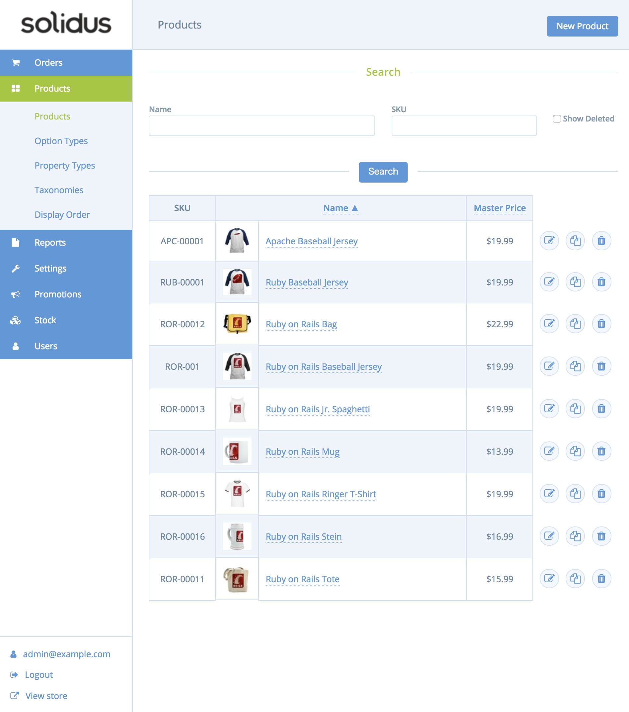

# 課題の前に

今回の課題の最重要点である Solidus が何をするライブラリで、どういう動作をするものなのか、公式のドキュメントで理解を深めることができましたか？座学の次は実践として実際Solidusアプリケーションに触れてみましょう。

セットアップが終わったら、`bunlde exec rails server` をすれば現在の状態のアプリケーションが起動します。起動し終えたら、以下の管理画面のログイン画面にアクセスし、管理画面を実際触ってみましょう。

[http://localhost/3000/admin](http://localhost/3000/admin)   
（ユーザー名とパスワードは初期データの登録時のものです）

ここに表示されている商品を使ってこれから課題を進めていくことになります。この画面をしっかり触って何ができるかを理解して先に進んでいきましょう！

