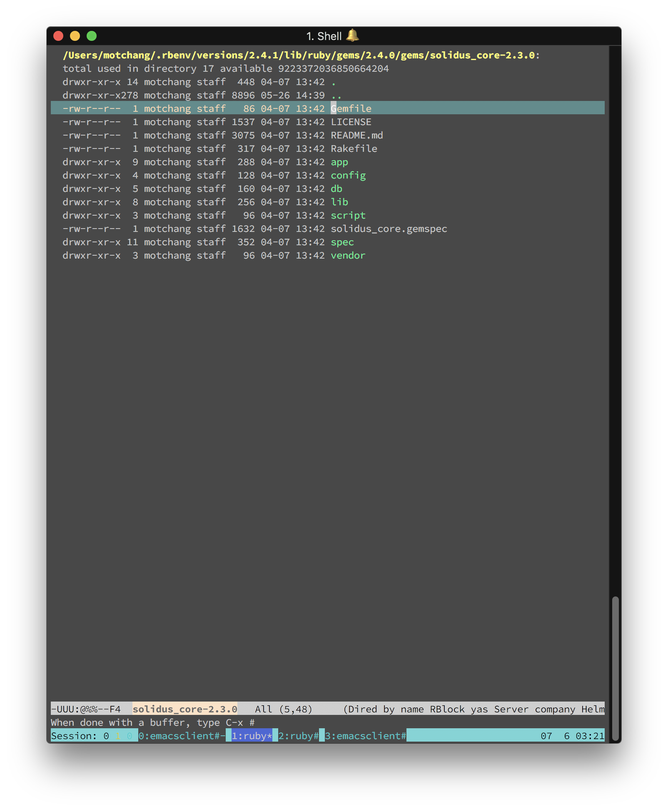

# 航海に必要な道具を揃える

### 大枠から理解していく

さて、これからさらに難しい課題を進めていくのですが、右も左もわからい中でコードを書くのは現実的ではありません。まずは公式のドキュメントを読み、公式ドキュメントでも分からないところは実際のテーブル定義やコードを閲覧して中身の振る舞いを理解していきましょう。

### ER図の自動生成

potepanec プロジェクトにはすでに `rails-erd` という gem が導入されています。この gem を使って、Solidus 全体の ER図を出力してみましょう。

下準備として、Rails アプリケーションの設定を変える必要があります。`config/environments/development.rb` から `config.eager_load` の行を探して、値を true に変更しましょう。

```ruby
config.eager_load = true
```

※ erdの出力が終わったら **このオプションをfalseに戻しておきましょう。** eager_loadオプションを入れたままにすることで、「開発環境でのサーバー起動中にクラスを編集した際にエラーが出る」という報告がしばしばあります。

設定が終わったら、`rails-erd` が依存している `Graphviz` をインストールし、ER図の出力コマンドを実行します。

```bash
brew install Graphviz
bundle exec erd --filename=tmp/erd
```

これで tmp ディレクトリのしたに erd.pdf というファイルが生成されたはずです。まずはこの ER図を見てみましょう。

ご覧になってみていかがでしたか？ちょっとテーブル数が大きすぎていきなり全体を頭にいれるのは難しいかもしれません。そのような場合は関係のあるモデルだけ抜き出して ER図を生成してみると良いでしょう。

[公式ドキュメント](http://voormedia.github.io/rails-erd/customise.html) に only というカンマ区切りのクラスを引数にとるオプションを見つけることができます。これを使ってみましょう！

```bash
bundle exec erd \
    --only='Spree::Taxonomy,Spree::Product,Spree::Taxon,Spree::Classification' \
    --filename=tmp/erd
```

いかがでしょうか？これでかなり理解できそうなER図が生成されたと思います。このように、問題の主眼にそった自動生成ドキュメントを駆使して課題を進めていきましょう。

### 箱メガネで海の中を覗く

一般的に Rails プロジェクトでは多数のオープンなライブラリを利用しながら進めていきます。つまり、現在使用しているライブラリへの深い理解が必要です。ここでは現在使用されているライブラリのソースコードを簡単に閲覧する方法を説明します。

プロジェクトの `Gemfile` には利用しているライブラリの名前が、Gemfileから自動生成される `Gemfile.lock` には依存性を解決し終わったあとの特定のバージョンのライブラリが記述されています。

ライブラリのプロジェクトサイト（主に github.com でホストされています）のソースコードを閲覧するのでも良いのですが、自分のプロジェクトで使っているものと、github に上がっている最新のコードで変更が入っている場合が多いです。実際ローカルで読み込んでいるライブラリのソースを読めるようにしておけば、自分のアプリケーションのデバッグがより捗ることでしょう！

#### エディタの設定

CUIのコマンドからエディタを起動するため、以下の設定を .bashrc （またはログインシェルの .rc ファイル）に設定してターミナルを再起動しましょう。（ここに例のないエディタをお使いの場合は週末講師にたずねてください）

Vim の場合

```bash
export EDTOR=vi
```

Atom の場合

```bash
export EDITOR=atom
```

#### ライブラリを開いてみる

solidus は責務に閉じたいくつかの gem で一つの機能を実現しています。ポテパンキャンプに関係しているところだと solidus\_core （モデル等）solidus\_backend （管理画面等）solidus\_frontend （ECサイト側機能等）です。ここでは solidus\_core を閲覧してみようと思います。

EDITOR環境変数が設定済みであることを確認し、以下のコマンドを入力します。

```bash
bundle open solidus_core
```

すると、指定したエディタで solidus\_core のルートディレクトリが開くはずです。



このライブラリは Rails Engine という方式で実装されているため、ライブラリの中のディレクトリ構成も普通の Rails アプリケーションと違いがありません。ですので、ディレクトリ構成も以下のようになっています。この構成はおなじみのものなので自由にソースコードを閲覧してみてください！

```text
.
├── app
│   ├── assets
│   │   ├── config
│   │   ├── images
│   │   └── javascripts
│   ├── controllers
│   │   └── spree
│   ├── helpers
│   │   └── spree
│   ├── jobs
│   │   └── spree
│   ├── mailers
│   │   └── spree
│   ├── models
│   │   ├── concerns
│   │   └── spree
│   └── views
│       ├── layouts
│       └── spree
├── config
│   ├── initializers
│   └── locales
├── db
│   ├── default
│   │   └── spree
│   └── migrate
├── lib
│   ├── generators
│   │   └── spree
│   ├── solidus
│   │   └── migrations
│   ├── spree
│   │   ├── core
│   │   ├── mailer_previews
│   │   ├── permission_sets
│   │   ├── promo
│   │   └── testing_support
│   └── tasks
│       └── migrations
├── script
├── spec
│   ├── fixtures
│   ├── helpers
│   ├── jobs
│   ├── lib
│   │   ├── search
│   │   ├── spree
│   │   └── tasks
│   ├── mailers
│   ├── models
│   │   └── spree
│   ├── shared_examples
│   └── support
│       ├── concerns
│       └── shared_contexts
└── vendor
    └── assets
        ├── javascripts
        └── stylesheets

```

また、他の solidus\_backend や solidus\_frontend のソースコードもぜひ読んでください！

