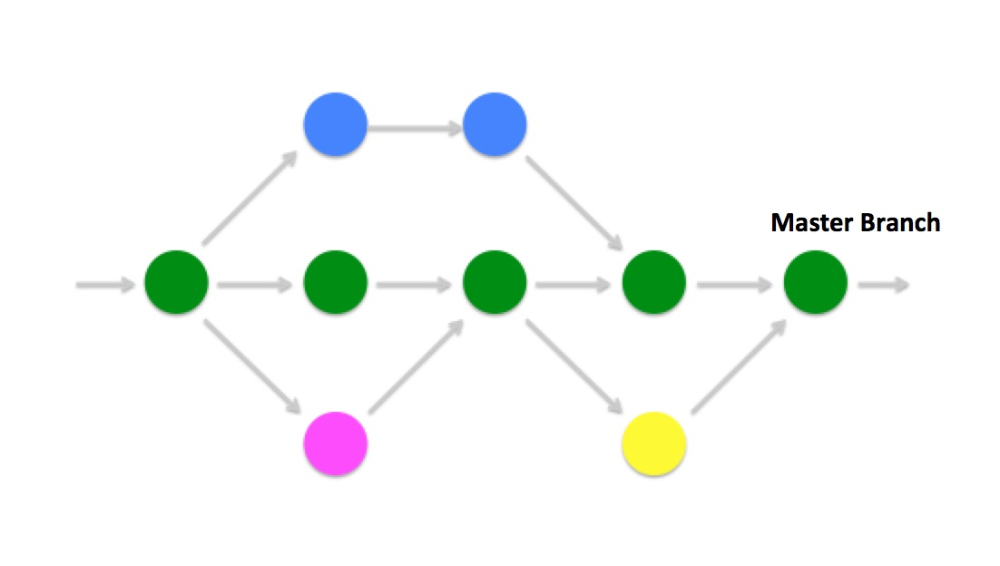

# はじめてのPRをたてる

## プログラムを作るだけでは終わらない

これからみなさんは、RailsをつかったECアプリの開発者として改修・機能拡張に取り組みます。
無事にプログラミングが終わり、手元のマシンで問題なく動作したら、何をすればいいでしょうか？

そう。自分の改善・改修を、実際に運用しているアプリケーションに反映する作業が必要です。

とはいっても、自分の作業結果を無秩序にアプリケーションに反映・公開してよいわけではありません。

例えば、こういう場合を想像してみてください。

* ユーザーが自分が想定していなかった使い方をしたせいで、サービスが停止した
* 思わぬセキュリティーホールが空いていたため、個人情報の流出事故に繋がった
* 自分が改修した影響で、アプリケーションの別の部分が動作しなくなっていた

## サービスが止まるということ

自分のコードが原因でサービスが停止する、というのはどういうことでしょうか？
端的な言い方をすれば、それは社員の給料の源泉を止めてしまうということです。

本番サーバーが落ちることがどれくらい深刻なのかは、アプリケーションによります。たとえば巨大サービスだったり金融系のサービスだったりすると、秒単位で札束が飛んでいくような損害が出ます。社内タスク管理ツールが停止した程度なら、実害がないこともあるでしょう。

ビルの工事に例えて言うならば、こんな感じでしょうか。

ビルの屋上で簡単な電気工事を頼まれて、無事にケーブルを通したが、知らずに水道設備に穴をあけてしまっていた。翌日の朝、ビルのテナントが一斉に水道を使いはじめたところ、屋上から大量の水漏れが発生してビル全体が使えなくなった・・。

## 標準的な開発サイクルとは

上で書いたようなミスを防ぐためには、何ができるでしょう？

実際の開発現場では **チームがお互いにコードにチェックを入れることでエラーを防ぐ** という方法が取られています。

### Git FlowとGithub Flow
gitのバージョン管理を利用したチーム開発フローには２つのメジャーなアプローチがあり、それぞれGit Flow / Github Flowと呼ばれています。以下ではポテパンで採用している[Github Flow](https://gist.github.com/Gab-km/3705015)を説明します。

### PRとは
このシステムではまず「本番アプリケーション（マスターブランチ）に自分のコード（開発ブランチ）を反映（マージ）したいのですが、念のためチェックをしてくれませんか」という依頼を、同僚や先輩にお願いすることから始まります。これがプルリクエスト（PR）といいます。

### コードレビューとは
それに対して、他の開発者は気になる部分にツッコミを入れたり、よりよい設計を提案したり、問題がなければ承認したり、という作業を行います。これをコードレビュー[^1]と言います。

（この段階で、PRされたコードに対して自動テストを回して動作チェックをしたり、本番環境に似せてつくったステージングサーバーにブランチを乗せて動作検証をすることも一般的です）

### マスターマージ
無事にプルリクエストが承認されたら、そのコードをマスターブランチに反映します。
マスターブランチに入ったコードは、自動（場合によっては手動）で本番サーバーに投入されます。ついに、本番アプリケーションで自分が書いたコードが動きはじめます！

ポテパンキャンプでは、クロスチェックをかける意味で、 **レビュアー２名の承認をもらったらマスターブランチにマージしてよい** という運用にしています。

### 次のサイクルへ
この後、開発者は最新のマスターを自分のローカルリポジトリにpullしたうえで、作業ブランチを切り出して再び開発を続けます。

[^1]: 初期のスタートアップや小規模な開発現場ではレビューがないこともありますが、コードレビューは世界的なスタンダードになっています。[たとえばRuby on Railsの開発](https://github.com/rails/rails/pulls)を見てみましょう。

## 大切なこと

1. コードに責任をもつのはあくまで実装者
PRは「間違いを指摘してもらうことで、自分の仕事から事故が起こる確率を減らす」ためのお願いです。レビューをもらっているとしても、あくまで **実装者が自分のコードに責任を持つ** ことが大原則です。相手に指摘されたことをわからないまま受け入れるのではなく、なるべく自分なりに資料を読み、手元で検証し、「この実装方針がよい」という根拠を説明できるエンジニアになりましょう。
「上司に事前に見せておけば、何かあっても上司が責任を取ってくれる」という意識でレビューに入るのは、エンジニアのキャリアとして致命傷になります。

2. レビューは「義務」ではない
開発中は誰もが「早く自分のチケットを処理したい」という気持ちになるものです。プルリクエストは、自分のミスをクロスチェックしてもらうために、他のエンジニアの貴重な時間を割いてもらうという側面があります。
ここで言いたいのは「レビュアーに感謝しましょう」ということではなく（それはそれで大切ですね）、自分自身のためにも「レビューしてもらいやすいPR」を書けるようになりましょう、という意味です。
OSSでも仕事の現場でも、レビューしやすい（結果として承認されやすい）PRを立てる人もいれば、コードが読みづらいせいでなかなかレビューしてもらえないPRも存在します。

ここでの目的は、みなさんに **自走できるエンジニア** としてキャリアを切り開いていってもらうことです。
腑に落ちない場合は、もう一度、"[ポテパンキャンプの考え方](potepankyanpuheyoukoso.md)"を読んでみましょう！

